# Interactive Funscript Video Player

[](https://github.com/grrimgrriefer/HismithFunscriptPlayer/actions/workflows/github-code-scanning/codeql)
[](https://github.com/grrimgrriefer/HismithFunscriptPlayer/actions/workflows/dependabot/dependabot-updates)

A web-based video player (built with Rust, Actix-web, and plain JavaScript) that synchronizes video playback with oscillating (e.g., Hismith) and vibrating (e.g., Wildolo) hardware devices via [Intiface / Buttplug.io](https://intiface.com/).

---

## Key Features

- **Funscript Synchronization**  
Continuous real-time intensity calculation from `.funscript` files.
- **On-Screen Graph & HUD**  
Real-time visualization of upcoming thrusts, intensity curve, beat markers, and active user-defined safety hardwarelimits.
- **Side-by-Side (SBS) 3D Support**  
SBS toggle and automatic activation for 32:9 aspect ratio videos.
- **Smart Next-Video Overlay**  
Automatic recommendations (Lower, Similar, Higher intensity) when a video or script ends, with preview thumbnail previews and intensity deltas (compared to the current video).
- **Folder Start Recommendations**  
Pre-select starting videos (Low ~20%, Medium ~35%, High ~50% intensity) when opening folders.
- **Intensity Modulation**  
Play scripts in normally (1x), half-beat (0.5x), quarter-beat (0.25x), or double-beat (2.0x) to allow easy variation and facilitate various toy-sizes.
- **Script Variant Support**  
Load custom alternate script variants (e.g., `.low.funscript`, `.hard.funscript`) for customized variations (i.e. custom pattern variations).
- **Vibration Modes**  
Choose between general intensity-scaled vibration (`Rate`) based on beats-per-minute, or pulse vibration with each beat indivually (`Beat`).
- **In-Browser Funscript Editor**  
Create or adjust funscripts directly in authoring tool using tap-along controls, multi-selection, dragging, etc. for interactive timeline editing.
- **Machine Calibration**  
Synchronize your hardware device to perfectly match the stroke speeds by calibrating it. This is to compensate for various friction levels, machine power, angles, etc.

---

## Setup & Quick Start

### 1. Prerequisites
- **Intiface Central / Engine:** 
  - Install and run [Intiface Central](https://intiface.com/central/).
  - Ensure the WebSocket server is active on the (default) port `12345` (`ws://127.0.0.1:12345/buttplug`).
  - Connect compatible devices inside Intiface.

### 2. Configuration (`.env`)
Create a `.env` file in the project root:

```bash
VIDEO_SHARE_PATH="/path/to/videos" # Absolute path to your video library (read-only is fine)
FUNSCRIPT_SHARE_PATH="/path/to/funscripts" # Absolute path to your funscript directory (write permissions)
HOST_IP=0.0.0.0 # Network IP (use 0.0.0.0 for Docker. Use your LAN IP when not using Docker)
SERVER_PORT=5441 # Server port (default is 5441. When using a different value, make sure to adjust the socket.js and Dockerfile)
```

### 3. Build & Run

#### Cargo (Native)
```bash
cargo run --release
```

#### Docker
```bash
docker build -t hismith-player-site:v1 . && \
docker run -d -p 5441:5441 \
  -e HOST_IP=0.0.0.0 \
  --user "$(id -u):$(id -g)" \ # uses current user by default, if you have custom read/write permissions (e.g. NAS) you can specify a custom user
  --mount type=bind,source=/path/to/videos,target=/path/to/videos,readonly \ # read only video folder
  --mount type=bind,source=/path/to/funscripts,target=/path/to/funscripts \ # writeable folder (funscripts, thumbnails, calibration settings, etc.)
  --name hismith-player hismith-player-site:v1
```

Open your browser at `http://<HOST_IP>:5441/site/`


---

## User Guide & Interface Overview

### URL Query Parameters
- **`?no_fullscreen=1`** (or `true`/`yes`)  
  Appended to the page URL (e.g. `http://<HOST_IP>:5441/site/?no_fullscreen=1`). Disables automatic browser fullscreen mode upon video playback start. Useful for windowed browsing, testing, or desktop setups.

### Directory Browser (Left Sidebar)
- **Toggle Directory Button**  
Click the top-left button to show or hide the file explorer.
- **Directory Hierarchy**  
Reflects your `VIDEO_SHARE_PATH` layout (skipping subfolders named `funscripts`).
- **Intensity Badges**  
Videos with scripts display color-coded badges indicating intensity in the format `Peak (Avg)` (e.g., `45 (22)`). Colors blend (gentle to intense) from green, to yellow, red, purple, cyan.
- **Folder Start Recommendations**  
Toggling a folder containing videos automatically presents a quick-selection of three suggested videos. With varied intensity: **Low (~20)**, **Medium (~35)**, or **High (~50)**. A specific video can also be chosen from the sidebar directly ofc.

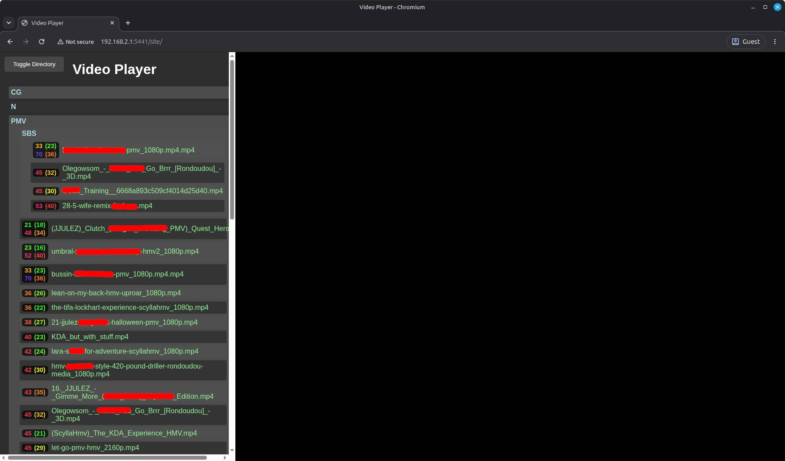

---

### On-Screen Display (HUD Graph)
When playing a video with a funscript attached, a real-time graph overlay appears at the bottom of the screen:
- **Green Curve**  
Continuous intensity curve calculated from the script.
- **Circles (Beat Markers)**  
Represent individual extended stroke hits (i.e. every `pos: 100`). The playhead flashes as it passes each circle.
- **Horizontal White/Red Line**  
Indicates your configured **Max Intensity Limit**. Only visible when the current video exceeds the limit, and will turn red only when it's actively clamping values to your custom hardware safety-limit.
- **Red Playhead Line:**  
Current playback timestamp.

<table>
  <tr>
    <td>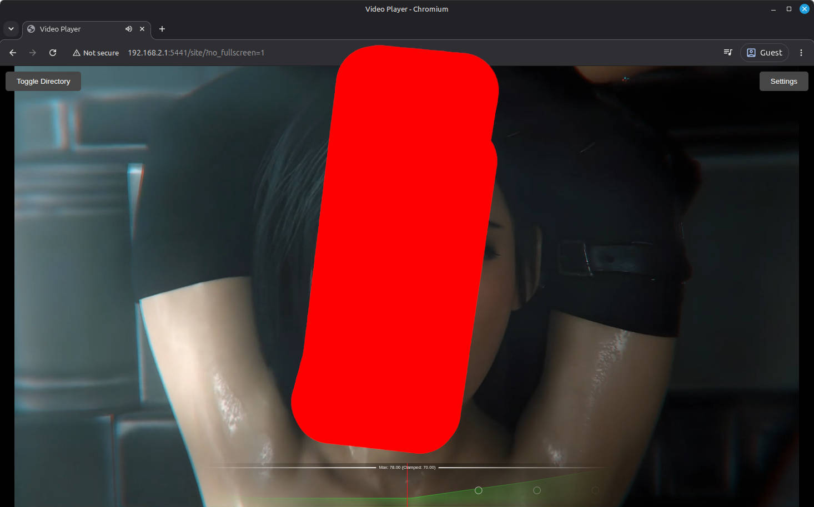</td>
    <td>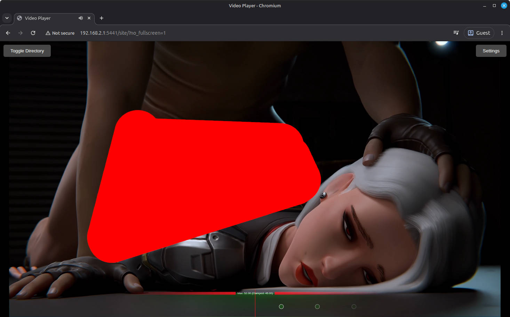</td>
  </tr>
</table>

---

### Settings Menu (Top-Right Button)
Click **Settings** in the top-right corner to open the player options panel

| Setting | Description |
| :--- | :--- |
| **SBS 3D Mode** | Changes the videoplayer settings for Side-by-Side 3D viewing in the Oculus Browser. (Automatically toggles on for 32:9 ratio videos). |
| **Loop Toggle** | Toggles looping of the current video on or off. |
| **Funscript Variant** | Visible when multiple `.funscript` variants exist for the current video (e.g., `original`, `low`, `hard`, `high`, `your custom name`). Click **Refresh** to rescan disk files. |
| **Calibration** | Opens the hardware calibration overlay. |
| **Max Intensity Limit** | Set a hard ceiling (0–100) for device commands (default: 60%). Click **Unlock** to specify a custom value. *Playback is automatically paused while unlocked, and starting playback will be refused until re-locked for safety.* |
| **Vibrate Mode** | **`Rate`**: Vibration intensity is continuous based on the stroke intensity.<br>**`Beat`**: Vibrates in pulses, on each stroke hit and decays rapidly before the next stroke. |
| **Intensity Modulation** | Skips beats or add extra beats to customize the intensity:<br>• `Quarter-beat (0.25x)`<br>• `Half-beat (0.5x)`<br>• `Normal (1.0x)`<br>• `Double-beat (2.0x)` |
| **Intensity Info** | Displays exact calculated **Peak** and **Average** intensity metrics for the currently active script. Takes selected script variants and **Speed Modulation** multipliers into account. |
| **Open Editor** | Opens the current video and script in the custom Funscript Editor in a new tab. |

<table>
  <tr>
    <td>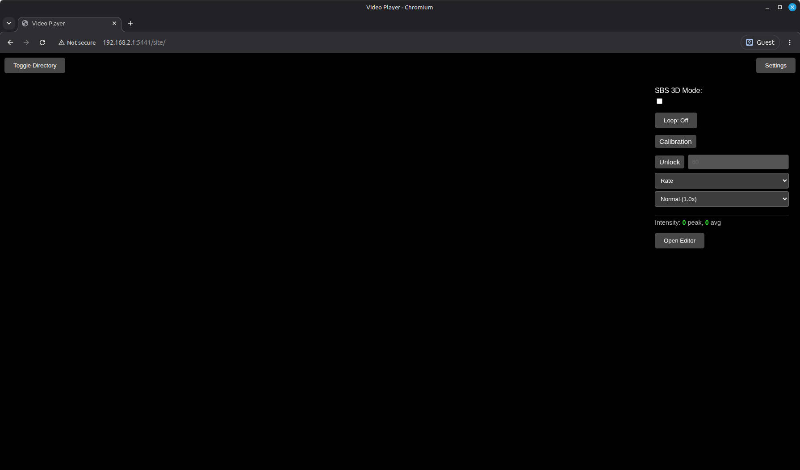</td>
    <td>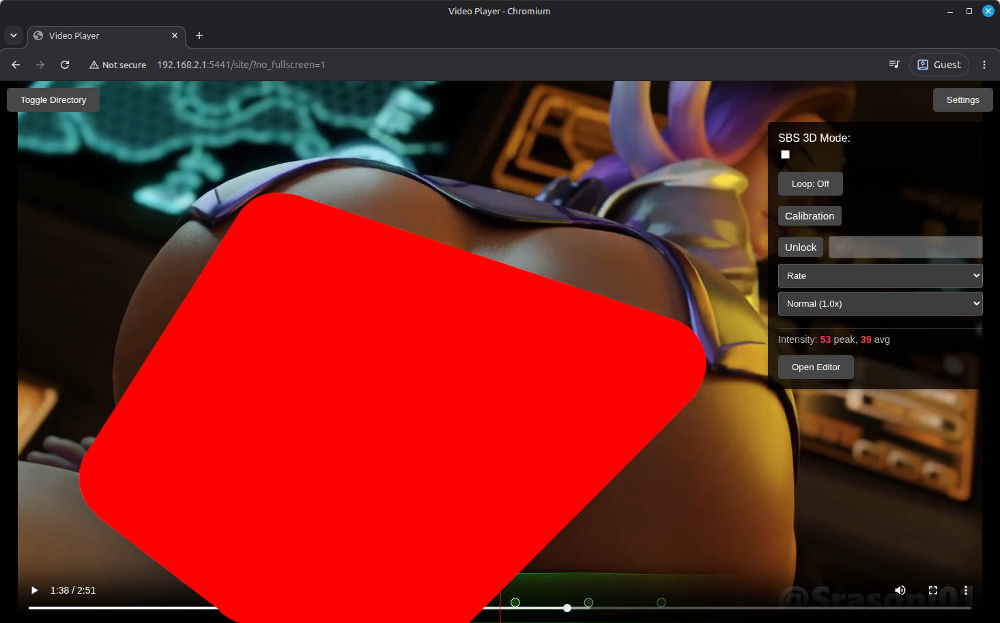</td>
  </tr>
</table>

---

### Up Next / Next Video Overlay
When a video ends (or when the script actions finish), an automated **Up Next** overlay opens with a 6-second countdown timer.

- **Options Provided:**
  - **Lower:** Selects a video from the same folder with a -7.5 to -22.5 delta lower peak intensity.
  - **Similar:** Selects a video with matching intensity (±7.5 delta peak intensity).
  - **Higher:** Selects a video with -7.5 to -22.5 delta higher peak intensity.
  - **Replay Current:** Restarts playback of the current video.
  - **Cancel:** Closes the overlay to remain on the completed video.
- Each button shows a thumbnail (`/site/thumbnails/...`), filename, and intensity diff relative to the current video (e.g., `+8.5 Peak / +2.1 Avg`).

<table>
  <tr>
    <td>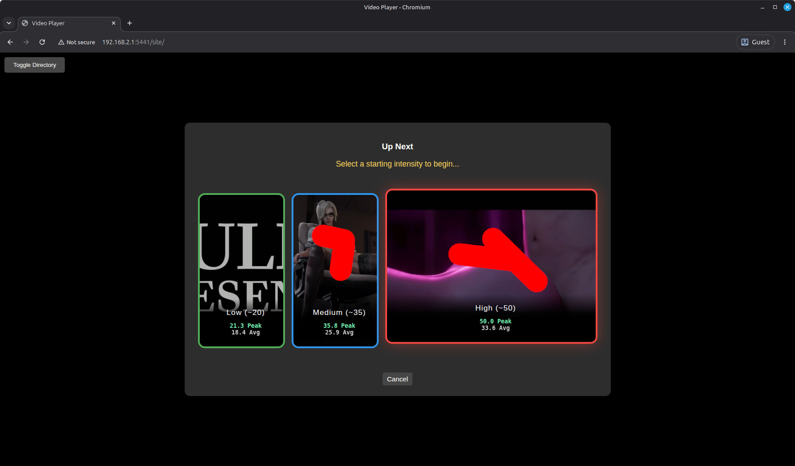</td>
    <td>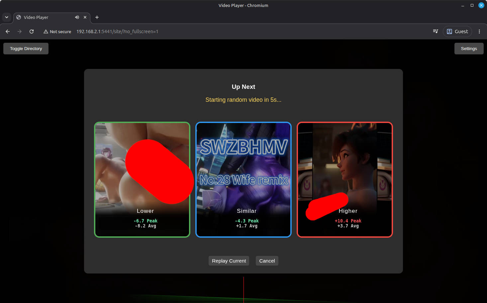</td>
  </tr>
</table>

---

## In-Browser Funscript Editor

Access the editor via **Settings → Open Editor**.

### Controls & Keyboard Shortcuts
- **Tap Thrust (`Spacebar` or `Tap Thrust` button)**  
Inserts a stroke extended point (`pos: 100`) at the current video playback timestamp.
- **Select Taps**  
Click and drag on the lower canvas timeline to highlight points.
- **Move Taps**  
Drag selected points left or right to shift timing.
- **Delete (`Delete` / `Backspace` key or `Delete Selected` button)**  
Removes all currently highlighted points.
- **Undo (`Undo Last Tap` button)**  
Removes the last placed tap.
- **Variant Field**  
Enter a custom variant name (e.g., `chill`, `hard`, `bumpy`, `knotted`, etc.) before saving to create a `.variant.funscript` file without overwriting `original`.
- **Save Funscript**  
Generates retraction points (`pos: 0`) and writes the `.funscript` file to disk under `FUNSCRIPT_SHARE_PATH`.

<table>
  <tr>
    <td>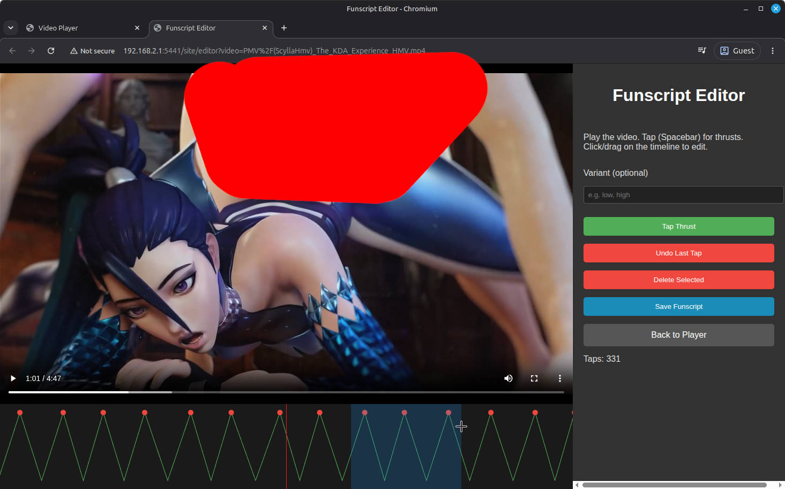</td>
    <td>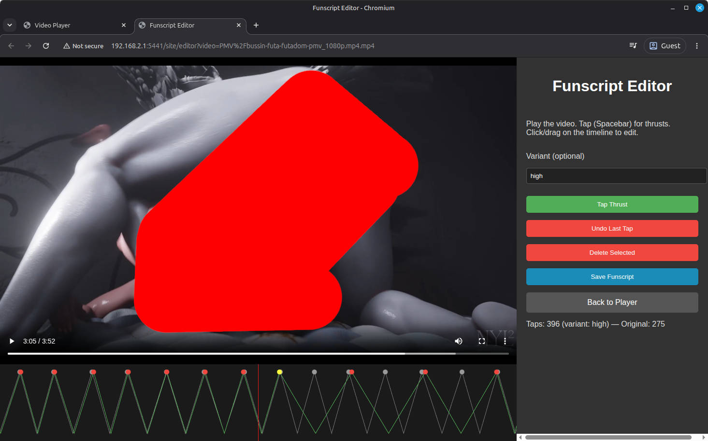</td>
  </tr>
</table>

---

## Hardware Calibration

Motor responsiveness and mechanical resistance differ across physical hardware (big/small toys, angle, logarithmic device power scaling). The Calibration tool maps screen intensities (10, 20, 30, 40, 50) to actual measured physical stroke rates (BPM).

### Calibration Steps:
1. Open **Settings → Calibration**.
2. Select an intensity preset button (e.g., **30%**).
3. Click **Start** to begin sending test movement commands to your physical device.
4. Tap along with the device rhythm using the **Spacebar** or by clicking the visual **Spinner**.
5. When a stable reading appears under **Measured BPM**, click **Save Point**.
6. Repeat for remaining intensity presets.
7. Calibration profiles can be named and saved to disk (`.calibration_profiles.json`) to persist across sessions.

<table>
  <tr>
    <td>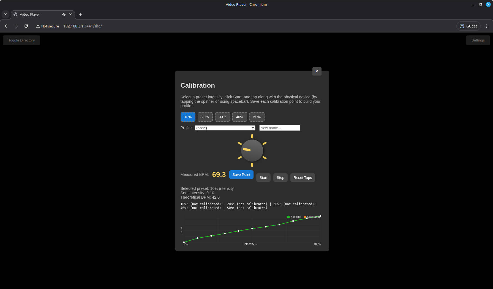</td>
    <td>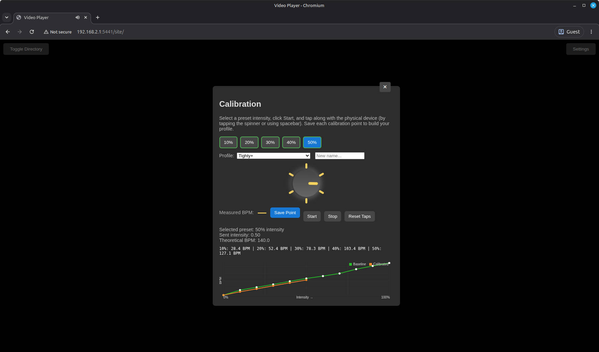</td>
  </tr>
</table>

_(device used for baselines is my HISMITH without any attachment)_

---

## Important notes

### 1. Funscript Format Requirements
> [!IMPORTANT]
> The automated intensity engine expects ONLY discrete position values of **`0`** (fully retracted) or **`100`** (fully extended). 
> Smooth multi-point funscripts containing intermediate values (e.g., 30, 70) are **not supported** by the intensity generator and you'll have to modify them or generate new ones in the internal editor.

### 2. Path Matching & Parent Directory Fallback
- Video files and funscripts are matched by relative directory path and file stem:
  - Video: `Category/VideoName.mp4`
  - Base Funscript: `Category/VideoName.funscript`
  - Variant Funscript: `Category/VideoName.hard.funscript`
- **Parent Fallback:** If a video file in a subfolder (e.g., a 3D SBS variant) lacks a script in its own directory, the server automatically checks the parent directory for a matching script.

---

## Troubleshooting & Edge Cases

### Unsupported Video Codecs (HEVC / H.265)
- **Symptom:** Audio plays normally, but the video screen remains black or shows a red error overlay: *"Unsupported video codec. This browser requires H.264/AVC."*
- Native web browser HTML5 video lacks built-in decoding support for HEVC (H.265).
- **Solution:** Re-encode affected files to **H.264 (AVC)** video with **AAC** audio using `ffmpeg`:
  ```bash
  ffmpeg -i input_video.mp4 -c:v libx264 -c:a copy output_h264.mp4
  ```

### Server Permission Denied (Cache / Saving Errors)
- **Symptom:** Red error banner appears in the file tree: *"Server cannot write to the funscripts directory; caching disabled..."*
- The server process lacks write permissions to `FUNSCRIPT_SHARE_PATH`. Write access is required to generate intensity caches (`.funscript_cache.json`), thumbnails (`.thumbnails/`), calibration profiles (`.calibration_profiles.json`), and save funscripts.
- **Solution:** Ensure the process or Docker container user owns or has write access to the funscript folder. (or specify a specific user that has the right permissions in the Docker run command)

### Device Connection Failures
- **Symptom:** Video plays smoothly, but connected devices do not move.
- **Troubleshooting:**
  1. Verify Intiface Central is running and connected to your hardware device.
  2. Confirm Intiface WebSocket port is set to `12345` (`ws://127.0.0.1:12345/buttplug`).
  3. Ensure your browser is not blocking local WebSocket traffic (`ws://HOST_IP:5441/ws`).
  4. Check the cargo / docker logs for potential firewall issues when using different devices for client/server (e.g. VR headset)

---

## Project Structure Overview

```text
├── src/
│   ├── main.rs                     # Entry point, env loading, Actix server setup
│   ├── routes.rs                   # Endpoint routing (/site, /api, /ws)
│   ├── intiface_socket.rs          # WebSocket actor receiving client device commands
│   ├── directory_browser.rs        # Video directory tree scanner
│   ├── funscript_cache.rs          # Funscript intensity hashing & caching
│   ├── buttplug/
│   │   ├── device_manager.rs       # Buttplug connection, scanning, & motor loop
│   │   └── funscript_utils.rs      # Funscript parsing, interpolation, & intensity math
│   └── handlers/
│       ├── video.rs                # Video streaming handler (HTTP Range support)
│       ├── funscript.rs            # Funscript loading & intensity curve generation
│       ├── editor.rs               # Funscript editor page & save POST API
│       ├── calibration.rs          # Calibration page & profile persistence API
│       └── thumbnail.rs            # Dynamic video thumbnail generator (ffmpeg)
├── static/                         # Web Client SPA (HTML, CSS, JS Modules)
│   ├── index.html / main.js        # Main web interface entry
│   ├── video_player.js             # Core playback loop, device control, & overlay state
│   ├── funscript_handler.js        # Intensity calculation & speed modulation logic
│   ├── funscript_display_graphs.js # Canvas HUD graph visualizer
│   ├── settings_menu.js            # Settings overlay & options handlers
│   ├── directory_tree.js           # File tree UI & intensity badge renderer
│   ├── editor.html / editor.js     # Interactive funscript editor UI & logic
│   └── calibration.html / .js      # Calibration modal & spinner logic
└── automation/
    └── check_durations.py          # Utility script to check video vs script duration deltas
```

## License

This project is licensed under the MIT License. See the [LICENSE](LICENSE) file for details.
